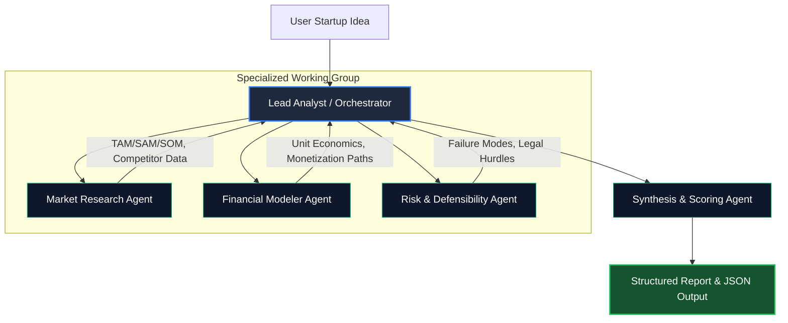

# Engineering Specification: Startup Validator AI
**Author:** Principal AI Engineer (DeepMind Alum)  
**Date:** July 10, 2026  
**Status:** PROPOSED (Spec-Driven Development Phase)

---

## 1. Vision & Strategy

Startup Validator AI is a professional-grade multi-agent reasoning system designed to democratize elite-tier venture capital due diligence. Instead of providing generic feedback, the system models the exact behavior of an investment committee. 

By employing multiple specialized, collaborative AI agents (Market, Finance, Risk, and Synthesis), the platform deconstructs a founder's raw startup idea, subjects it to adversarial market testing, designs simulated financial scenarios, and issues a structured, multi-dimensional Investment Memorandum.

### The Tone: The "Skeptical Analyst"
The system avoids generic encouragement (e.g., *"This is a great idea!"*). It adopts the persona of a seasoned, direct, yet constructive investment analyst. The analysis is data-driven, objective, and focuses heavily on identifying failure modes, customer acquisition challenges, structural market trends, and unit economic viability.

---

## 2. Functional Requirements

### 2.1. Ideation & Input Fleshing
- **Dynamic Input Helper**: A guided, interactive input field that helps users expand a simple idea (e.g., *"Airbnb for pets"*) into a structured submission by prompting for key details: target customer, primary value proposition, and monetization model (optional).
- **Asynchronous Analysis Pipeline**: Users submit the idea and receive immediate UI feedback. The multi-agent pipeline is queued and runs asynchronously.

### 2.2. Multi-Agent Orchestration & Real-Time Visualization
- **Live Orchestration Feed**: An interactive, visual canvas showing agent relationships and data flow (e.g., "Market Researcher is querying Google Search...", "Financial Analyst is constructing unit economics model...").
- **Agent Logging**: A terminal-style or clean log panel showing the agents' chain-of-thought, sub-queries, and internal deliberations in real-time.

### 2.3. The Interactive Validation Report
Once the agents finish processing, the platform renders a structured dashboard containing:
1. **Executive Summary & Verdict**: The "Investment Thesis" and a calculated **Startup Validation Score** (0-100) split across market, product, and financial feasibility.
2. **Market Dynamics**: Total Addressable Market (TAM) estimation, competitor matrix, and macroeconomic trends.
3. **Financial Modeler**: Pro-forma unit economics (LTV/CAC projection, pricing suggestions, estimated margin, capital intensity).
4. **Red Team / Risk Assessment**: Failure modes, regulatory/compliance roadblocks, and suggested defensibility moats.
5. **PDF Export**: Clean, publication-ready PDF generator of the validation report.

### 2.4. "Talk to the Lead Analyst"
- An interactive chatbot interface attached to the generated report.
- The user can query the findings, challenge assumptions (e.g., *"What if my CAC is lower because of organic viral loops?"*), and trigger real-time recalculations from the Financial Modeler agent.

---

## 3. Non-Functional Requirements

### 3.1. Performance & Latency
- **Time-to-Interactive (TTI)**: The landing page must load in under 1.2s on average networks.
- **Streaming Pipeline Updates**: The server must stream progress updates via Server-Sent Events (SSE) or WebSockets every 500ms during the multi-agent execution phase to avoid user drop-off due to high LLM inference times.
- **Report Generation SLA**: The full multi-agent synthesis must complete in $\le 45$ seconds.

### 3.2. Reliability, Cost, & LLM Operations (LLMOps)
- **Token Budget Control**: Strict usage of system instruction caching (e.g., Gemini Prompt Caching) for large agent system instructions.
- **Structured Output Guarantees**: Forced JSON Schema output mode on all agent LLM calls to prevent parsing failures.
- **Failover Mechanism**: If a primary high-reasoning model (e.g., Gemini 1.5 Pro / GPT-4o) fails or hits rate limits, the system must gracefully fallback to a fast-tier model (e.g., Gemini 1.5 Flash / GPT-4o-mini) and mark the report section as "Standard Analysis" rather than crashing.

### 3.3. Security & IP Protection
- **Idea Confidentiality**: All user submissions are transient or encrypted. No user-submitted ideas are used for public training datasets.
- **Rate Limiting**: IP-based and user-token-based rate limits (e.g., max 3 validations per day for free tier, 50/day for premium) to prevent API cost abuse.

---

## 4. User Flow

```mermaid
sequenceDiagram
    autonumber
    actor User as User (Founder)
    participant UI as Frontend (Vite/React)
    participant API as Backend (Node.js/Next.js API)
    participant Orchestrator as Agent Orchestrator
    participant Agents as Specialized Agents (Market, Finance, Risk)
    
    User->>UI: Input startup idea ("Airbnb for pets")
    UI->>UI: Interactive Flesher refines idea
    User->>UI: Click "Validate Idea"
    UI->>API: POST /api/validate (Idea payload)
    API-->>UI: 202 Accepted (Session ID)
    
    rect rgb(20, 25, 40)
        note right of UI: Real-time progress visualization loop
        UI->>API: Establish Server-Sent Events (SSE) stream
        API->>Orchestrator: Initialize execution graph
        Orchestrator->>Agents: Market Research Agent runs (Search Web)
        Orchestrator->>API: Publish status: "Market Research running..."
        API-->>UI: Event: Market Research Status
        Orchestrator->>Agents: Financial Modeler & Risk Analyst run in parallel
        Orchestrator->>API: Publish status: "Modeling financials & assessing risk..."
        API-->>UI: Event: Parallel Processing Status
        Orchestrator->>Agents: Synthesis Agent runs (Aggregates and scores)
        Orchestrator->>API: Publish status: "Synthesizing investment memo..."
        API-->>UI: Event: Finalizing Report
    end

    Orchestrator->>API: Save completed report to DB
    API-->>UI: Event: COMPLETED (Report Payload)
    UI->>User: Display interactive Report & open Chat Interface
```



---

## 5. Agent Architecture

The system utilizes a **Hierarchical Agent Topology** managed by a central **Orchestrator**.



### 5.1. Orchestrator (Lead Analyst)
- **Role**: Coordinates the workflow, schedules agent executions, transfers contexts between agents, and manages global state.
- **Capabilities**: Deconstructs the initial input, determines what external searches the Market Research Agent should perform, and resolves dependencies (e.g., Financial Modeler needs Market Agent's pricing estimates before executing).

### 5.2. Market Research Agent
- **Role**: Evaluates market landscape, target audience, sizing, and competitive positioning.
- **Tools**: Google Search API / Tavily, Competitor Scrapers.
- **System Instructions**:
  ```text
  You are an expert Market Research Analyst specializing in venture capital market sizing.
  Your task is to estimate TAM, SAM, and SOM based on the provided startup idea.
  Be highly specific. Identify 3-4 direct and indirect competitors. Do not return generic estimates.
  If the market size is unknown, build a bottom-up estimation model based on typical industry pricing.
  ```

### 5.3. Financial Modeler Agent
- **Role**: Proposes business models, estimates CAC/LTV dynamics, margin structures, and capital efficiency.
- **Tools**: Mathematical calculator, monetization template lookup.
- **System Instructions**:
  ```text
  You are an elite VC Financial Associate. Your goal is to stress-test the unit economics of the startup idea.
  Select the most appropriate business model (SaaS, marketplace, transactional, subscription).
  Model key financial drivers: Customer Acquisition Cost (CAC), Lifetime Value (LTV), gross margins, and estimated time to profitability.
  Highlight critical assumptions that could break the model.
  ```

### 5.4. Risk & Defensibility Agent (The "Red Team")
- **Role**: Adversarial evaluator. Finds reasons why this startup will *fail*.
- **Tools**: Industry failure database lookup, legal/regulatory analyzer.
- **System Instructions**:
  ```text
  You are a cynical Red Team Investigator and Regulatory Expert.
  Your sole responsibility is to find structural, regulatory, distribution, or operational reasons why this startup will fail.
  Identify the top 3 critical failure modes.
  Rate the defensibility (moat strength) from Weak to Strong, and explain why.
  ```

### 5.5. Synthesis & Scoring Agent
- **Role**: Aggregates all data into a cohesive investment memo and computes the final scorecard.
- **Tools**: Scoring algorithm execution.
- **System Instructions**:
  ```text
  You are the Managing Partner of a venture capital fund.
  Review the inputs from the Market, Financial, and Risk agents.
  Synthesize these findings into an Executive Investment Memo.
  Formulate a clear "Investment Verdict" (e.g., Invest, Watch, Pass) with a rigorous validation score (0-100).
  ```

---

## 6. API Contracts

### 6.1. Initiate Validation Session
- **Endpoint**: `POST /api/v1/validate`
- **Headers**: `Content-Type: application/json`
- **Request Body**:
```json
{
  "rawIdea": "I want to build Airbnb for pets, where pet owners can find verified local sitters with cage-free homes.",
  "additionalContext": {
    "targetAudience": "Urban professionals who travel frequently",
    "primaryMonetization": "Take rate on transactions (marketplace model)"
  }
}
```
- **Response**: `202 Accepted`
```json
{
  "sessionId": "val_session_889a712f5b",
  "status": "queued",
  "createdAt": "2026-07-10T01:45:00Z",
  "links": {
    "status": "/api/v1/validate/status/val_session_889a712f5b",
    "ws_stream": "ws://api.startupvalidator.ai/v1/stream/val_session_889a712f5b"
  }
}
```

### 6.2. Fetch Execution Status (Polling Fallback)
- **Endpoint**: `GET /api/v1/validate/status/:sessionId`
- **Response**: `200 OK`
```json
{
  "sessionId": "val_session_889a712f5b",
  "status": "processing",
  "progressPercentage": 45,
  "activeAgent": "Financial Modeler Agent",
  "logs": [
    {
      "timestamp": "2026-07-10T01:45:02Z",
      "agent": "Market Research Agent",
      "message": "TAM calculated at $4.2B using bottom-up marketplace modeling."
    },
    {
      "timestamp": "2026-07-10T01:45:10Z",
      "agent": "Financial Modeler Agent",
      "message": "Initiating LTV/CAC projection based on average pet boarding fees ($45/night)."
    }
  ]
}
```

### 6.3. Retrieve Final Structured Report
- **Endpoint**: `GET /api/v1/validate/report/:sessionId`
- **Response**: `200 OK`
- **Body**: *Matches the Synthesis Agent Output Schema (Section 7).*

### 6.4. Session Chat (Conversational Analyst)
- **Endpoint**: `POST /api/v1/validate/chat`
- **Request Body**:
```json
{
  "sessionId": "val_session_889a712f5b",
  "message": "What if we charge sitters a premium listing fee instead of a transactional take rate?",
  "history": [
    { "role": "user", "content": "Initial idea: Airbnb for pets." },
    { "role": "assistant", "content": "Our analysis indicates marketplace transaction fees are optimal..." }
  ]
}
```
- **Response**: `200 OK (Streamed chunk by chunk as `text/event-stream`)`

---

## 7. JSON Schemas for Agent Outputs

To ensure the system works reliably with deterministic UI layouts, all agent outputs are strictly typed.

### 7.1. Global Synthesized Report Schema

```json
{
  "$schema": "http://json-schema.org/draft-07/schema#",
  "title": "StartupValidationReport",
  "type": "object",
  "properties": {
    "sessionId": { "type": "string" },
    "startupIdeaSummary": { "type": "string" },
    "metrics": {
      "type": "object",
      "properties": {
        "overallScore": { "type": "integer", "minimum": 0, "maximum": 100 },
        "marketScore": { "type": "integer", "minimum": 0, "maximum": 100 },
        "financialScore": { "type": "integer", "minimum": 0, "maximum": 100 },
        "riskScore": { "type": "integer", "minimum": 0, "maximum": 100 }
      },
      "required": ["overallScore", "marketScore", "financialScore", "riskScore"]
    },
    "verdict": {
      "type": "object",
      "properties": {
        "classification": { "type": "string", "enum": ["Highly Viable", "Seed-Ready with Cautions", "Pivot Recommended", "High-Risk Pass"] },
        "summary": { "type": "string" },
        "primaryRecommendation": { "type": "string" }
      },
      "required": ["classification", "summary", "primaryRecommendation"]
    },
    "marketAnalysis": {
      "type": "object",
      "properties": {
        "tam": { "type": "string" },
        "marketSizingExplanation": { "type": "string" },
        "competitors": {
          "type": "array",
          "items": {
            "type": "object",
            "properties": {
              "name": { "type": "string" },
              "strengths": { "type": "array", "items": { "type": "string" } },
              "weaknesses": { "type": "array", "items": { "type": "string" } },
              "defensibilityOpportunity": { "type": "string" }
            },
            "required": ["name", "strengths", "weaknesses", "defensibilityOpportunity"]
          }
        }
      },
      "required": ["tam", "marketSizingExplanation", "competitors"]
    },
    "financialModel": {
      "type": "object",
      "properties": {
        "businessModelType": { "type": "string" },
        "suggestedPricing": { "type": "string" },
        "unitEconomics": {
          "type": "object",
          "properties": {
            "estimatedCAC": { "type": "string" },
            "estimatedLTV": { "type": "string" },
            "paybackPeriodMonths": { "type": "integer" },
            "grossMarginPercentage": { "type": "number" }
          },
          "required": ["estimatedCAC", "estimatedLTV", "paybackPeriodMonths", "grossMarginPercentage"]
        },
        "capitalIntensity": { "type": "string", "enum": ["Low", "Medium", "High"] }
      },
      "required": ["businessModelType", "suggestedPricing", "unitEconomics", "capitalIntensity"]
    },
    "riskAssessment": {
      "type": "object",
      "properties": {
        "defensibilityRating": { "type": "string", "enum": ["Weak Moat", "Standard Moat", "Strong Moat"] },
        "criticalRisks": {
          "type": "array",
          "items": {
            "type": "object",
            "properties": {
              "riskArea": { "type": "string" },
              "severity": { "type": "string", "enum": ["Low", "Medium", "High", "Critical"] },
              "mitigationStrategy": { "type": "string" }
            },
            "required": ["riskArea", "severity", "mitigationStrategy"]
          }
        }
      },
      "required": ["defensibilityRating", "criticalRisks"]
    }
  },
  "required": ["sessionId", "startupIdeaSummary", "metrics", "verdict", "marketAnalysis", "financialModel", "riskAssessment"]
}
```

---

## 8. Directory & Project Structure

The project will use **Next.js 15 (App Router)** with **TypeScript**, **Tailwind CSS**, and **Prisma** for storage.

```text
startup-validator-ai/
├── src/
│   ├── app/                    # Next.js App Router
│   │   ├── layout.tsx          # Global entry layout and SEO tags
│   │   ├── page.tsx            # Premium Landing Page / Input Form
│   │   ├── dashboard/          # Dynamic dashboard route
│   │   │   └── [sessionId]/    # Workspace for specific report
│   │   │       └── page.tsx
│   │   └── api/                # API Endpoints
│   │       ├── validate/
│   │       │   ├── route.ts    # POST endpoint starting orchestrator
│   │       │   └── status/     # SSE streaming route
│   │       └── chat/
│   │           └── route.ts    # Streaming chatbot logic
│   │
│   ├── components/             # Reusable UI Components
│   │   ├── ui/                 # Custom primitives (GlassCard, Button, Input)
│   │   ├── AgentCanvas/        # Dynamic flow graph visualization
│   │   ├── MetricsRadar/       # SVG-based Radar/Spider chart
│   │   ├── FinanceModeler/     # Interactive sliders and CAC/LTV graphs
│   │   └── TerminalLogs/       # Streaming LLM logs
│   │
│   ├── agents/                 # Multi-Agent Framework
│   │   ├── orchestrator.ts     # Core routing engine (State Machine)
│   │   ├── MarketAgent.ts      # Web browsing and competitor mapping
│   │   ├── FinanceAgent.ts     # Calculations and modeling
│   │   ├── RiskAgent.ts        # Red-teaming and compliance check
│   │   └── SynthesisAgent.ts   # Formatting output and scorecard execution
│   │
│   ├── lib/                    # Shared Libraries
│   │   ├── gemini.ts           # Configured Gemini SDK wrapper
│   │   ├── search.ts           # Tavily / Google Search Helper
│   │   └── prisma.ts           # Database connection manager
│   │
│   └── styles/
│       └── globals.css         # Custom tokens, gradients, animations
│
├── prisma/
│   └── schema.prisma           # SQLite or PostgreSQL database schema
├── public/                     # Static assets, branding logo SVGs
├── package.json
└── tsconfig.json
```

---

## 9. UI & Design Specification

### 9.1. Design System Tokens
- **Theme**: Ultra-Premium Dark Mode. Pure blacks combined with dark slate backgrounds to create deep layering.
- **Color Palette**:
  - `Background`: Primary `#030712` (Slate-950), Secondary `#0B0F19` (Glass Card base)
  - `Accent Primary`: `#10B981` (Emerald Green - symbol of validation & financial success)
  - `Accent Secondary`: `#6366F1` (Indigo - represents agent connectivity & AI intelligence)
  - `Risk/Alert`: `#F43F5E` (Rose - highlights validation failure points)
  - `Border / Ring`: `#1E293B` (Slate-800), with custom opacity mappings.
- **Typography**:
  - Primary Font: **Outfit** (via Google Fonts) for headers and metrics. Clean, geometric, feels mathematical yet modern.
  - Body Font: **Inter** (via Google Fonts) for maximum readability.
- **Styling Paradigm**:
  - Glassmorphic panels with subtle backdrop blurs (`backdrop-blur-md`), thin borders, and radial background gradients mimicking DeepMind dashboard designs.

### 9.2. Component States (Visual Walkthrough)

#### 9.2.1. Ideation Page (Idle State)
- Clean, centered input module.
- "Analyze Idea" button with a slow glowing emerald pulse animation.
- Subtle background animation: abstract floating vector particles moving slowly, representing unformed ideas.

#### 9.2.2. Processing State (Active Run)
- Split screen:
  - **Left**: Live agent process map. An SVG node graph where nodes glow when active:
    - `[Market Research]` (Glows Purple when querying web)
    - `[Financial Modeler]` (Glows Green when run)
    - `[Risk Red Team]` (Glows Amber during stress test)
  - **Right**: Console stream. Emulates developer-style, clean mono-spaced readouts showing the agents reasoning logs.

#### 9.2.3. Dashboard View (Final Report)
- **Feasibility Header**: Features the three metrics (Market, Finance, Risk) represented as custom SVG ring gauges or a unified spider web radar chart.
- **Financial interactive block**: Sliders for user to manipulate `CAC` or `Price Point` and watch the profit margins recalculate in real-time.

---

## 10. Error Handling & Edge Cases

### 10.1. LLM API Failures
- **Timeout**: Set an API request timeout at 15 seconds per agent call. If tripped, the Orchestrator initiates a retry block. If retries fail twice, the agent is skipped, and a cached standard static model generates a basic answer.
- **Output Corruption**: If the output does not parse against the JSON schemas, the validator triggers an automated recovery prompt back to the LLM (Self-Correction loop):
  ```text
  ERROR: The response did not match the required JSON Schema. Error: [Error Details].
  Please correct the formatting and output valid JSON only.
  ```

### 10.2. Market Search Ambiguity
- If the user inputs a highly obscure, localized, or nonsensical startup idea (e.g., *"Selling vacuum-sealed air from my bedroom to my neighbor"*):
  - The Market Research agent will return a low volume of search queries.
  - **Action**: The system flags the idea as "Niche / Non-scalable" and automatically penalizes the market score below 30. It presents a warning banner in the dashboard: *"Sparsity of market data suggests extremely narrow TAM."*

---

## 11. Scalability & Future Roadmap


### 11.1. Phase 1 (MVP) - Current Spec
- Linear sequential agent execution using predefined JSON schemas and system prompts.
- Mocked database or local SQLite schema.

### 11.2. Phase 2 - Graph-Based Routing & Agent Memory
- Transition to a graph framework (e.g., LangGraph or custom state graph).
- **Cross-Agent Debates**: Allow the Financial Agent and Risk Agent to debate. For example, if the Financial Agent projects high margin but the Risk Agent flags heavy compliance fees, they will debate and run automated compromise cycles before generating the final report.

### 11.3. Phase 3 - Real-Time Data Integration & Platform Expansion
- Real-time APIs for Crunchbase, PitchBook, and Patent DBs to check if the idea has already been patented or funded.
- automated landing page generation: Once validated, the user can click "Deploy Landing Page" to generate a simple Vercel-ready landing page with a waitlist form to validate demand.
