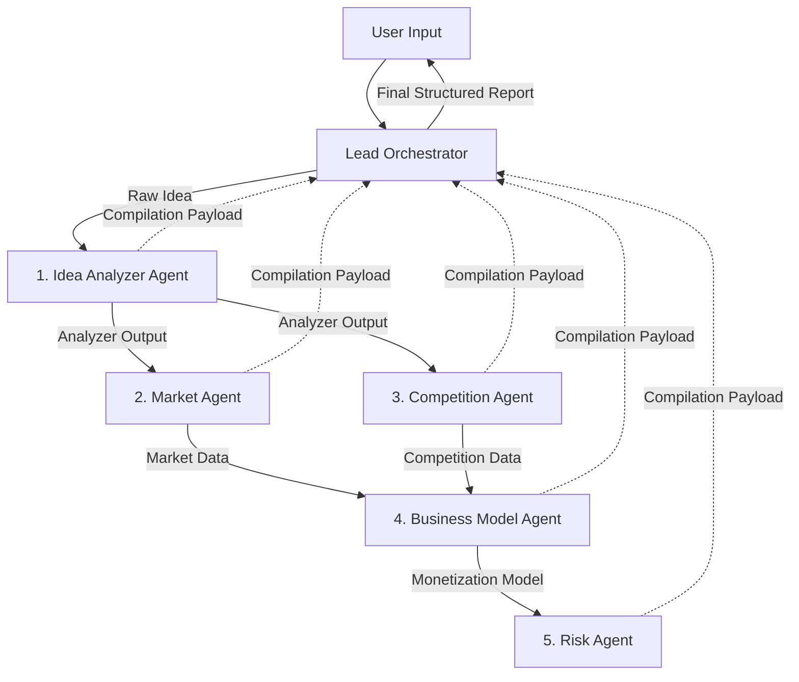

# Multi-Agent System Architecture Design
**Project:** Startup Validator AI  
**Author:** Principal AI Engineer (DeepMind Alum)  
**Status:** PROPOSED  

---

## 1. Architectural Overview

This document specifies the communication interfaces, execution sequencing, system prompts, and strict JSON outputs for the multi-agent reasoning system powering **Startup Validator AI**. 

The system operates as a **directed acyclic orchestration graph** (DAG) where a central **Orchestrator** schedules and routes data between five specialized worker agents. Every worker agent outputs structured data using JSON Schemas to guarantee that downstream agents and the frontend application receive deterministic, typed interfaces.



---

## 2. Specialized Agent Definitions

### 2.1. Idea Analyzer Agent

#### Purpose
Deconstructs the raw user startup pitch into foundational product dimensions, framing the exact problem space, customer demographics, industry categories, and unique value propositions.

#### Input
- `rawIdea` (String): Raw pitch text provided by the user.
- `additionalContext` (Object): Optional target audience, geography, or domain filters.

#### Output
- `ideaAnalysis` (Object matching the JSON schema below).

#### Responsibilities
1. **Vertical Classification**: Determine the startup's primary category (e.g., SaaS, Marketplace, FinTech, D2C).
2. **Customer Persona Definition**: Define primary target customer personas who experience the pain point.
3. **Problem Framing**: Explicitly formulate the specific problem being solved, separating it from symptoms.
4. **Uniqueness Extraction**: Extract the core differentiator or innovation implied in the founder's initial concept.

#### Prompt Template
```text
You are an expert Startup Incubation Director and Product Strategist. Your job is to dissect a raw startup idea and structure it into foundational business dimensions.

User Idea: {{rawIdea}}
User Context: {{additionalContext}}

Deconstruct the idea to identify:
1. Startup Category: The primary industry and model classifications.
2. Target Customer: A description of the primary customer profile and target segments.
3. Core Problem: The key problem or inefficiency that this product solves.
4. Uniqueness: The core differentiator or value proposition that separates it from standard market offerings.

Strictly adhere to the JSON schema. Be highly analytical, precise, and objective.
```

#### JSON Schema
```json
{
  "$schema": "http://json-schema.org/draft-07/schema#",
  "title": "IdeaAnalysis",
  "type": "object",
  "properties": {
    "startupCategory": { 
      "type": "string", 
      "description": "Primary industry vertical (e.g., SaaS, FinTech, B2B Marketplace, D2C E-commerce)" 
    },
    "customer": {
      "type": "object",
      "properties": {
        "primarySegment": { "type": "string", "description": "e.g., Small business owners, Gen Z travellers" },
        "painPoints": { "type": "array", "items": { "type": "string" } }
      },
      "required": ["primarySegment", "painPoints"]
    },
    "problem": {
      "type": "object",
      "properties": {
        "statement": { "type": "string", "description": "Clear problem statement" },
        "severity": { "type": "string", "enum": ["Low", "Medium", "High", "Critical"] }
      },
      "required": ["statement", "severity"]
    },
    "uniqueness": {
      "type": "object",
      "properties": {
        "coreDifferentiator": { "type": "string" },
        "valueProposition": { "type": "string" }
      },
      "required": ["coreDifferentiator", "valueProposition"]
    }
  },
  "required": ["startupCategory", "customer", "problem", "uniqueness"]
}
```

---

### 2.2. Market Agent

#### Purpose
Evaluates macroeconomic factors, demand indicators, structural growth trends, and estimates target market sizes.

#### Input
- `ideaAnalysis` (Object from the Idea Analyzer Agent)
- `searchQueryResults` (Array of Strings/Markdown representing market reports and search statistics)

#### Output
- `marketFeasibility` (Object matching the JSON schema below)

#### Responsibilities
1. **Market Sizing**: Estimate the Total Addressable Market (TAM) based on top web search results and bottom-up sizing metrics.
2. **Demand Gauging**: Identify and summarize signs of customer demand (search query volumes, transaction indicators, or customer survey reports).
3. **Trend Tracking**: Identify 2 key trends (macroeconomic, behavioral, or technical) shaping the sector.
4. **Growth Opportunity Identification**: Spot a specific segment or geographic market opportunity representing the best entry point.

#### Prompt Template
```text
You are a Venture Capital Market Analyst. Your task is to calculate the addressable market size, evaluate active demand, and define trends based on the parsed startup idea and search results.

Startup Analysis:
{{ideaAnalysis}}

Web Search Results:
{{searchQueryResults}}

Determine:
1. Total Addressable Market (TAM) with a specific size and estimation methodology.
2. Active customer demand indicators or proxy metrics (e.g. search volumes, transaction records in adjacent fields).
3. Two macro trends shaping the market and whether their impact on this startup is positive, negative, or neutral.
4. A specific growth opportunity or niche that represents the optimal entry point.

Strictly adhere to the JSON schema.
```

#### JSON Schema
```json
{
  "$schema": "http://json-schema.org/draft-07/schema#",
  "title": "MarketFeasibility",
  "type": "object",
  "properties": {
    "marketSize": {
      "type": "object",
      "properties": {
        "tam": { "type": "string", "description": "Monetary value (e.g., $4.5B)" },
        "methodology": { "type": "string" }
      },
      "required": ["tam", "methodology"]
    },
    "demand": {
      "type": "object",
      "properties": {
        "indicators": { "type": "array", "items": { "type": "string" } },
        "strength": { "type": "string", "enum": ["Weak", "Moderate", "Strong"] }
      },
      "required": ["indicators", "strength"]
    },
    "trends": {
      "type": "array",
      "items": {
        "type": "object",
        "properties": {
          "trendDescription": { "type": "string" },
          "impact": { "type": "string", "enum": ["Positive", "Negative", "Neutral"] }
        },
        "required": ["trendDescription", "impact"]
      }
    },
    "opportunity": {
      "type": "string",
      "description": "Specific niche or initial target market launch path"
    }
  },
  "required": ["marketSize", "demand", "trends", "opportunity"]
}
```

---

### 2.3. Competition Agent

#### Purpose
Identifies competitive threats, maps direct and indirect competitor segments, and evaluates strategic differentiation.

#### Input
- `ideaAnalysis` (Object from the Idea Analyzer Agent)
- `searchQueryResults` (Array of Strings/Markdown representing competitive lookup searches)

#### Output
- `competitiveLandscape` (Object matching the JSON schema below)

#### Responsibilities
1. **Direct Competitor Mapping**: Identify 2 direct competitor brands or products solving the exact same problem for the same audience.
2. **Indirect Competitor Mapping**: Identify 2 indirect competitors (alternative methods, legacy spreadsheets, adjacent industries).
3. **Differentiation Framework**: Highlight concrete product vectors (pricing, feature set, customer support, data privacy) where this startup holds a tactical advantage.

#### Prompt Template
```text
You are a Competitive Intelligence Lead. Your job is to locate and evaluate direct and indirect competitors for a new startup concept based on search results.

Startup Analysis:
{{ideaAnalysis}}

Web Search Results:
{{searchQueryResults}}

Extract:
1. Two direct competitors. Identify their core strengths, weaknesses, and market share indicators.
2. Two indirect competitors (alternative workarounds or adjacent solutions).
3. The primary differentiation vectors (where this new idea wins and how it defends itself against these competitors).

Adhere strictly to the JSON schema. Focus on objective performance parameters rather than marketing copy.
```

#### JSON Schema
```json
{
  "$schema": "http://json-schema.org/draft-07/schema#",
  "title": "CompetitiveLandscape",
  "type": "object",
  "properties": {
    "directCompetitors": {
      "type": "array",
      "items": {
        "type": "object",
        "properties": {
          "name": { "type": "string" },
          "strengths": { "type": "array", "items": { "type": "string" } },
          "weaknesses": { "type": "array", "items": { "type": "string" } }
        },
        "required": ["name", "strengths", "weaknesses"]
      },
      "minItems": 2
    },
    "indirectCompetitors": {
      "type": "array",
      "items": {
        "type": "object",
        "properties": {
          "name": { "type": "string" },
          "alternativeMethod": { "type": "string", "description": "How they solve the problem differently (e.g., using Excel)" }
        },
        "required": ["name", "alternativeMethod"]
      },
      "minItems": 2
    },
    "differentiation": {
      "type": "object",
      "properties": {
        "vectors": { "type": "array", "items": { "type": "string" }, "description": "e.g., lower switching cost, hyper-local networks" },
        "differentiationScore": { "type": "integer", "minimum": 1, "maximum": 10 }
      },
      "required": ["vectors", "differentiationScore"]
    }
  },
  "required": ["directCompetitors", "indirectCompetitors", "differentiation"]
}
```

---

### 2.4. Business Model Agent

#### Purpose
Formulates pricing levels, select primary monetization systems, and structures operational and long-term revenue channels.

#### Input
- `ideaAnalysis` (Object)
- `marketFeasibility` (Object)
- `competitiveLandscape` (Object)

#### Output
- `businessModel` (Object matching the JSON schema below)

#### Responsibilities
1. **Pricing Structure**: Propose specific pricing units (e.g. per-month subscription tiers, usage quotas, platform take rates).
2. **Monetization Mechanics**: Define how the business captures value from the customer (B2B license, transaction cut, advertising, white labeling).
3. **Revenue Stream Diversity**: Design secondary revenue streams (data licensing, API access, premium features) to maximize LTV.

#### Prompt Template
```text
You are a Principal VC Pricing Consultant. Your job is to structure the monetization strategy, pricing levels, and long-term revenue streams for this startup idea.

Startup Analysis:
{{ideaAnalysis}}
Market Analysis:
{{marketFeasibility}}
Competitive Landscape:
{{competitiveLandscape}}

Define:
1. The pricing tiers/models, suggesting actual numbers and billing frequencies.
2. The core monetization model (e.g., SaaS subscription, transaction cut).
3. Alternative or secondary revenue streams to improve LTV over time.

Adhere strictly to the JSON schema. Ensure prices are aligned with competitor margins and vertical benchmarks.
```

#### JSON Schema
```json
{
  "$schema": "http://json-schema.org/draft-07/schema#",
  "title": "BusinessModel",
  "type": "object",
  "properties": {
    "pricing": {
      "type": "object",
      "properties": {
        "structure": { "type": "string", "description": "e.g., freemium, usage-based tiers" },
        "suggestedTiers": {
          "type": "array",
          "items": {
            "type": "object",
            "properties": {
              "tierName": { "type": "string" },
              "pricePoint": { "type": "string" },
              "featuresIncluded": { "type": "array", "items": { "type": "string" } }
            },
            "required": ["tierName", "pricePoint", "featuresIncluded"]
          }
        }
      },
      "required": ["structure", "suggestedTiers"]
    },
    "monetization": { "type": "string", "description": "Primary value capture mechanism" },
    "revenueStreams": {
      "type": "array",
      "items": {
        "type": "object",
        "properties": {
          "source": { "type": "string" },
          "description": { "type": "string" }
        },
        "required": ["source", "description"]
      }
    }
  },
  "required": ["pricing", "monetization", "revenueStreams"]
}
```

---

### 2.5. Risk Agent

#### Purpose
Identifies vulnerability vectors across technical complexity, market fit, execution requirements, and legal compliance.

#### Input
- `ideaAnalysis` (Object)
- `marketFeasibility` (Object)
- `competitiveLandscape` (Object)
- `businessModel` (Object)

#### Output
- `riskProfile` (Object matching the JSON schema below)

#### Responsibilities
1. **Technical Risk Assessment**: Pinpoint performance, scale, system complexity, or dependencies that threaten implementation.
2. **Market Risk Assessment**: Frame user acquisition costs, macro shocks, high churn risks, or adoption resistance.
3. **Execution Risk Assessment**: Document operational bottlenecks, talent gaps, high capital dependencies, or cold start problems.
4. **Legal Risk Assessment**: Scan for intellectual property, compliance frameworks (SOC2, HIPAA, GDPR, SEC), and potential liabilities.

#### Prompt Template
```text
You are a Risk Red-Teamer. Your job is to conduct a cold, objective risk assessment across Technical, Market, Execution, and Legal vectors.

Startup Context:
Idea Analysis: {{ideaAnalysis}}
Market: {{marketFeasibility}}
Competition: {{competitiveLandscape}}
Business Model: {{businessModel}}

Detail the top risks in:
1. Technical Risks (complexity, APIs, scalability).
2. Market Risks (adoption, competition, macro).
3. Execution Risks (operations, cost, cold-start).
4. Legal Risks (regulatory compliance, intellectual property).

For each vector, provide a severity rating (Low, Medium, High, Critical) and a concrete, tactical mitigation strategy. Adhere strictly to the JSON schema.
```

#### JSON Schema
```json
{
  "$schema": "http://json-schema.org/draft-07/schema#",
  "title": "RiskProfile",
  "type": "object",
  "properties": {
    "technicalRisks": {
      "type": "array",
      "items": {
        "type": "object",
        "properties": {
          "risk": { "type": "string" },
          "severity": { "type": "string", "enum": ["Low", "Medium", "High", "Critical"] },
          "mitigation": { "type": "string" }
        },
        "required": ["risk", "severity", "mitigation"]
      }
    },
    "marketRisks": {
      "type": "array",
      "items": {
        "type": "object",
        "properties": {
          "risk": { "type": "string" },
          "severity": { "type": "string", "enum": ["Low", "Medium", "High", "Critical"] },
          "mitigation": { "type": "string" }
        },
        "required": ["risk", "severity", "mitigation"]
      }
    },
    "executionRisks": {
      "type": "array",
      "items": {
        "type": "object",
        "properties": {
          "risk": { "type": "string" },
          "severity": { "type": "string", "enum": ["Low", "Medium", "High", "Critical"] },
          "mitigation": { "type": "string" }
        },
        "required": ["risk", "severity", "mitigation"]
      }
    },
    "legalRisks": {
      "type": "array",
      "items": {
        "type": "object",
        "properties": {
          "risk": { "type": "string" },
          "severity": { "type": "string", "enum": ["Low", "Medium", "High", "Critical"] },
          "mitigation": { "type": "string" }
        },
        "required": ["risk", "severity", "mitigation"]
      }
    }
  },
  "required": ["technicalRisks", "marketRisks", "executionRisks", "legalRisks"]
}
```

---

## 3. Orchestration & Final Synthesis

### 3.1. Orchestrator Responsibilities
- Maps user inputs to trigger the execution queue.
- Executes `Idea Analyzer Agent` first.
- Invokes `Market Agent` and `Competition Agent` in parallel (providing them with both the idea analyzer results and real-time search engine crawler tool results).
- Runs `Business Model Agent` once the market and competitor payloads are retrieved.
- Invokes `Risk Agent` as the final stress-test step using all preceding outputs.
- Compiles all JSON outputs, calculates feasibility indexes, and structures the final comprehensive report.

### 3.2. Final Structured Report JSON Schema

```json
{
  "$schema": "http://json-schema.org/draft-07/schema#",
  "title": "StartupValidationReport",
  "type": "object",
  "properties": {
    "sessionId": { "type": "string" },
    "createdAt": { "type": "string" },
    "overallScore": { "type": "integer", "minimum": 0, "maximum": 100 },
    "overallVerdict": { "type": "string", "enum": ["Highly Viable", "Seed-Ready with Cautions", "Pivot Recommended", "High-Risk Pass"] },
    "ideaAnalysis": { "$ref": "#/definitions/IdeaAnalysis" },
    "marketFeasibility": { "$ref": "#/definitions/MarketFeasibility" },
    "competitiveLandscape": { "$ref": "#/definitions/CompetitiveLandscape" },
    "businessModel": { "$ref": "#/definitions/BusinessModel" },
    "riskProfile": { "$ref": "#/definitions/RiskProfile" }
  },
  "required": [
    "sessionId",
    "createdAt",
    "overallScore",
    "overallVerdict",
    "ideaAnalysis",
    "marketFeasibility",
    "competitiveLandscape",
    "businessModel",
    "riskProfile"
  ]
}
```
*(Definitions mapping standard schemas defined in Section 2 above).*
